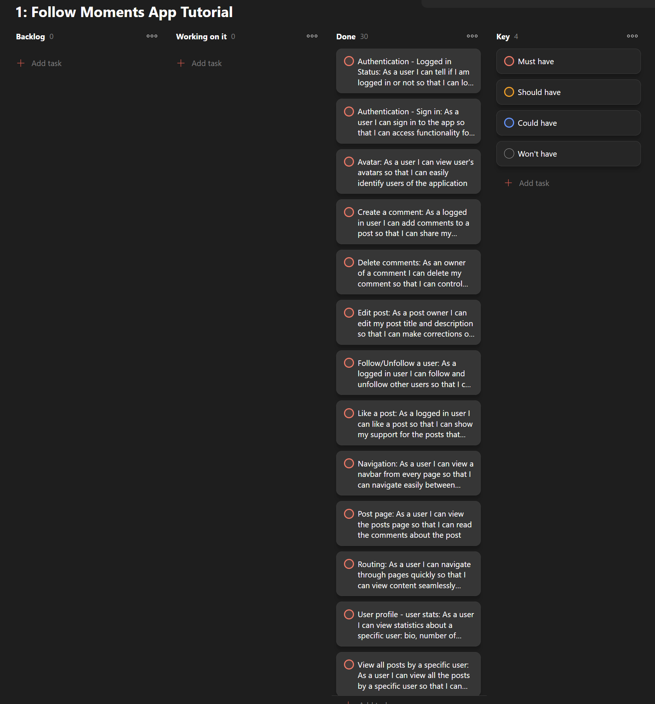
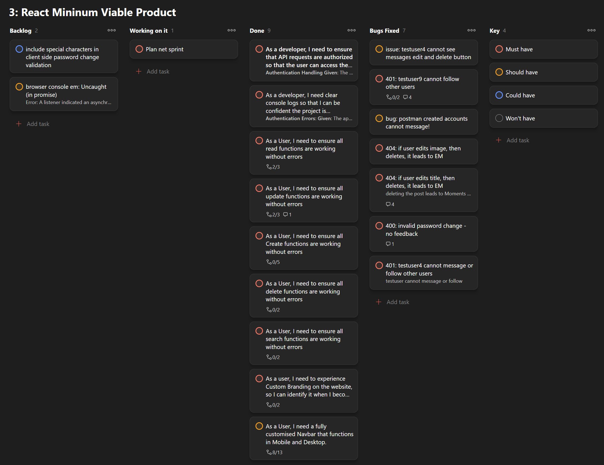
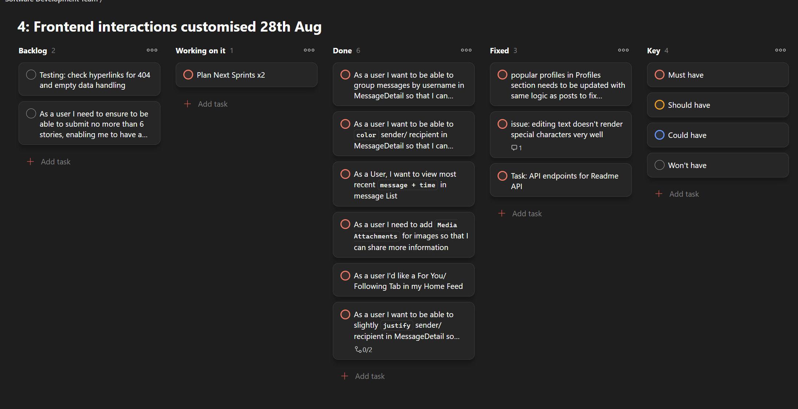

# Agile Method

For this project, we will be using the Agile methodology to manage the development process. Agile is an iterative and incremental approach to software development that focuses on delivering value to the customer quickly and continuously. 

Epics, sprints and user stories are used to break down the project into manageable chunks and to track progress. There were of course many tasks and bugs in each sprint, however despite their importance they are omitted for readability. 

I will focus on the user stories that were completed in each sprint, along with their priority, as it is more relevant to the project's success and helping the reader understand the project's development process.

# Project Overview

| Epic                                         |                                                       | Sprint (links to Kanban)                                                                                                                                                     | Length     | Start      | Finish     |
| -------------------------------------------- | ----------------------------------------------------- | ---------------------------------------------------------------------------------------------------------------------------------------------------------------------------- | ---------- | ---------- | ---------- |
|                                              |                                                       |                                                                                                                                                                              |            |            |            |
|Deploy a functioning app|1|Functioning Backend API and Frontend App as per "Moments" Template|14 days|16/07/2024|30/07/2024|
|1 new model, customised frontend, CI PASS|2|Implement Direct Messaging App (Send/Receive Messages)|8 days|31/07/2024|08/08/2024|
| |3|Reach Mininum Viable Product, remove Moments branding|15 days|09/08/2024|24/08/2024|
| |4|Customise Frontend Interactions|3 days|25/08/2024|28/08/2024|
|Enhance UI, customise other models, CI Merit|5|Implement new Profiles Feed and animations|3 days|29/08/2024|01/09/2024|
| |6|Update responsive design.|3 days|02/09/2024|05/09/2024|
| |7|Jailbreak testing|3 days|06/09/2024|09/09/2024|
|1 new model / CI Distinction|8|Notifications includes Messages, Likes and Follows|3 days|10/09/2024|13/09/2024|
| |9|Refine Frontend|3 days|14/09/2024|17/09/2024|
| |10|Readme|3 days|18/09/2024|21/09/2024|

# Sprint 1: Functioning Backend API and Frontend App as per "Moments" Template

| Start date: 16/07/2024 | End date: 30/07/2024 | Length: 14 days |
|:----|:----|:----|

Click here to view the Kanban board for Sprint 1

***

In this sprint, we will be deploying a functioning app with a backend API and frontend app as per the "Moments" template. This will involve setting up the backend API, creating a new model, and customising the frontend to display the new model.

The user stories below are actually from the Moments template, but they are a good starting point for our project. Later, e will need to customise the frontend to display our new model, and we will also need to create a new model for direct messages.

|User Story (Done)|MosCow|
|:----|:----|
|Authentication - Logged in Status: As a user I can tell if I am logged in or not so that I can log in if I need to|Must have|
|Authentication - Sign in: As a user I can sign in to the app so that I can access functionality for logged in users|Must have|
|Avatar: As a user I can view user's avatars so that I can easily identify users of the application|Must have|
|Create a comment: As a logged in user I can add comments to a post so that I can share my thoughts about the post|Must have|
|Delete comments: As an owner of a comment I can delete my comment so that I can control removal of my comment from the application|Must have|
|Edit post: As a post owner I can edit my post title and description so that I can make corrections or update my post after it was created|Must have|
|Follow/Unfollow a user: As a logged in user I can follow and unfollow other users so that I can see and remove posts by specific users in my posts feed|Must have|
|Like a post: As a logged in user I can like a post so that I can show my support for the posts that interest me|Must have|
|Navigation: As a user I can view a navbar from every page so that I can navigate easily between pages|Must have|
|Post page: As a user I can view the posts page so that I can read the comments about the post|Must have|
|Routing: As a user I can navigate through pages quickly so that I can view content seamlessly without page refresh|Must have|
|User profile - user stats: As a user I can view statistics about a specific user: bio, number of posts, follows and users followed so that I can learn more about them|Must have|
|View all posts by a specific user: As a user I can view all the posts by a specific user so that I can catch up on their latest posts, or decide I want to follow them|Must have|
|View liked posts: As a logged in user I can view the posts I liked so that I can find the posts I enjoy the most|Must have|
|View posts of followed users: As a logged in user I can view content filtered by users I follow so that I can keep up to date with what they are posting about|Must have|
|View most recent posts: As a user I can view all the most recent posts, ordered by most recently created first so that I am up to date with the newest content|Must have|
|View comments: As a user I can read comments on posts so that I can read what other users think about the posts|Must have|
|View a post: As a user I can view the details of a single post so that I can learn more about it|Must have|
|Update username and password: As a logged in user I can update my username and password so that I can change my display name and keep my profile secure|Must have|
|Profile page: As a user I can view other users profiles so that I can see their posts and learn more about them|Must have|
|Navigation: Conditional rendering - As a logged out user I can see sign in and sign up options so that I can sign in/sign up|Must have|
|Most followed profiles: As a user I can see a list of the most followed profiles so that I can see which profiles are popular|Must have|
|Infinite scroll: As a user I can keep scrolling through the images on the site, that are loaded for me automatically so that I don't have to click on "next page" etc|Must have|
|Edit profile: As a logged in user I can edit my profile so that I can change my profile picture and bio|Must have|
|Edit a comment: As an owner of a comment I can edit my comment so that I can fix or update my existing comment|Must have|
|Create posts: As a logged in user I can create posts so that I can share my images with the world!|Must have|
|Comment date: As a user I can see how long ago a comment was made so that I know how old a comment is|Must have|
|Authentication - Sign up: As a user I can create a new account so that I can access all the features for signed up users|Must have|
|Authentication - Refreshing access tokens: As a user I can maintain my logged-in status until I choose to log out so that my user experience is not compromised|Must have|
|As a user, I can search for posts with keywords, so that I can find the posts and user profiles I am most interested in.|Must have|

# Sprint 2: Implement Direct Messaging App (Send/Receive Messages)

Click here to view the Kanban board for Sprint 2

| Start date: 31/07/2024 | End date: 08/08/2024 | Length: 8 days |
|:----|:----|:----|

In this sprint, we will be implementing a direct messaging app that allows users to send and receive messages. This will involve creating a new model for messages and customising the frontend to display messages in a chat-like interface.

|User Story Completed |MoSCow|
|:----|:----|
|As the Authorised User I need to read a complete conversation so that I can read messages @MessageDetail @MessageList|Must have|
|As the Authorised User I need to add to a conversation thread so that I can send messages @MessageDetail @MessageList|Must have|
|As the Authorised User I need to be able to locate any user and start new chat @MessageDetail @MessageList|Must have|
|As the Authorised User I need to start a new chat so that I can make new connections @MessageDetail @MessageList|Must have|
|As the Authorised User I need to delete chats so that I can protect my privacy @MessageDetail @MessageList|Must have|
|As the Authorised User I need to delete messages I send so that I can correct mistakes @MessageDetail @MessageList|Should have|
|As the Authorised User I need to read messages with a clear interface showing what time message was recieved @MessageDetail @MessageList|Should have|
|As the Authorised User I need to update messages I have already sent so that I can correct mistakes @MessageDetail @MessageList|Should have|

# Sprint 3: Reach Mininum Viable Product, remove Moments branding

Click here to view the Kanban board for Sprint 3

| Start date: 09/08/2024 | End date: 24/08/2024 | Length: 15 days |
|:----|:----|:----|

In this sprint, we will be removing the branding from the Moments template and replacing it with our own branding. We will also be testing the app to ensure that it is functioning as expected.

|User Story|MoSCow|
|:----|:----|
|As a developer, I need to ensure that API requests are authorized so that the user can access their data without encountering 401 Unauthorized errors.|Must Have|
|As a developer, I need clear console logs so that I can be confident the project is sustainable and has no bugs for the user|Must Have|
|As a User, I need to ensure all read functions are working without errors|Must Have|
|As a User, I need to ensure all update functions are working without errors|Must Have|
|As a User, I need to ensure all Create functions are working without errors|Must Have|
|As a User, I need to ensure all delete functions are working without errors|Must Have|
|As a User, I need to ensure all search functions are working without errors|Must Have|
|As a user, I need to experience Custom Branding on the website, so I can identify it when I become a returning user.|Must Have|
|As a User, I need a fully customised Navbar that functions in Mobile and Desktop.|Should Have|

# Sprint 4: Customise Frontend Interactions

 Click here to view the Kanban board for Sprint 4

| Start date: 25/08/2024 | End date: 28/08/2024 | Length: 3 days |
|:----|:----|:----|

In this sprint, we will be customising the frontend interactions to improve the user experience. This will involve updating the frontend design to make it more user-friendly and intuitive.

|User Story|MoSCow|
|:----|:----|
|As a user I want to be able to group messages by username in MessageDetail so that I can distinguish messages easier|Must Have|
|As a user I want to be able to `color` sender/ recipient in MessageDetail so that I can distinguish messages easier|Must Have|
|As a User, I want to view most recent `message + time` in message List|Must Have|
|As a user I need to add `Media Attachments` for images so that I can share more information|Must Have|
|As a user I'd like a For You/ Following Tab in my Home Feed|Must Have|
|As a user I want to be able to slightly `justify` sender/ recipient in MessageDetail so that I can distinguish messages easier|Must Have|

The following user stories were eventually not included in this sprint, but they may be considered for future sprints:

|User Story|MoSCow|
|:----|:----|
|As a user I need to ensure to be able to submit no more than 6 stories, enabling me to have a mindful experience.|Won't Have|
|As a user I want to be able to see which messages I have and haven't read, so I can keep aware of which messages I'm using|Won't Have|
|As a user I need an advanced feed that displays Most Followed, Most Recent, and Following|Won't Have|
|As a user, I'd like to be able to `pin` my most important messages|Won't Have|
|As a user I want to be able to `bookmark` messages to come back to|Won't Have|
|As a user I want to be able to search inside messages and for users|Won't Have|

# Use of Kanban Boards

Todoist was chosen as the software of choice for this project, for it's appropriate simplicity and ease of use. The Kanban board was used to track the progress of each sprint, and to ensure that all user stories were completed on time. The board was updated daily to reflect the progress of each user story, and to identify any potential roadblocks or issues that needed to be addressed.

